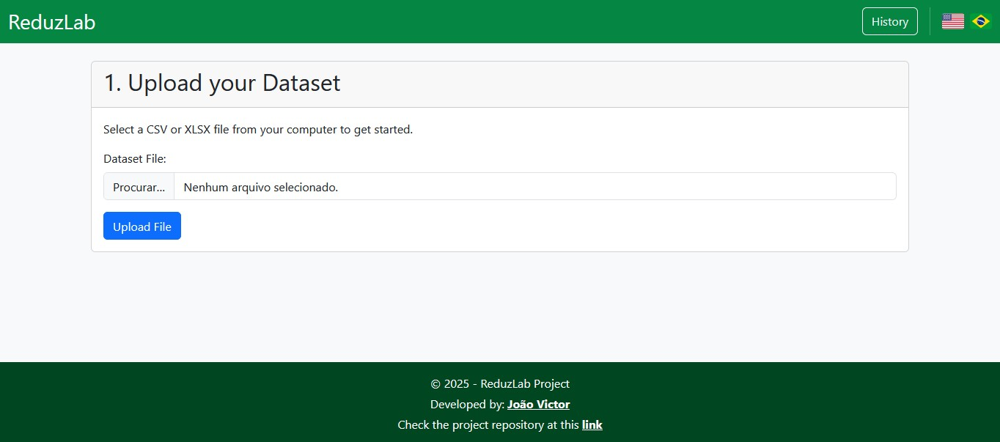
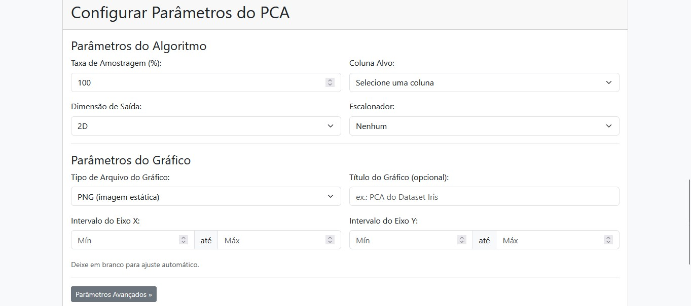
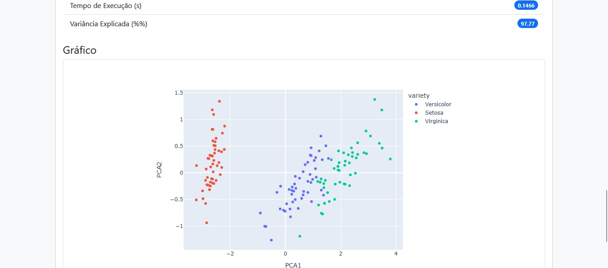
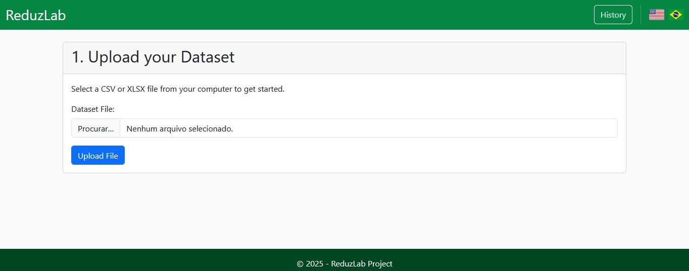
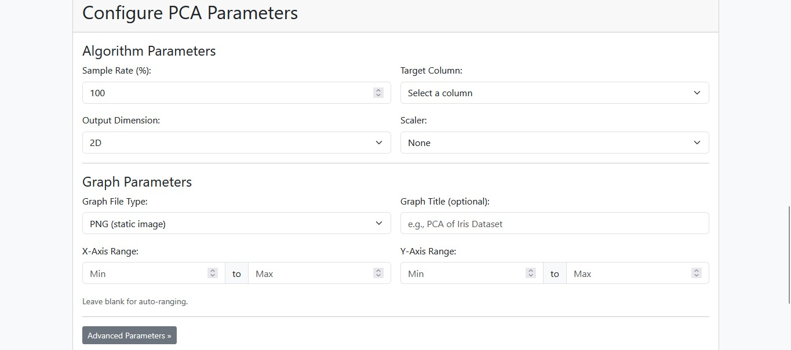
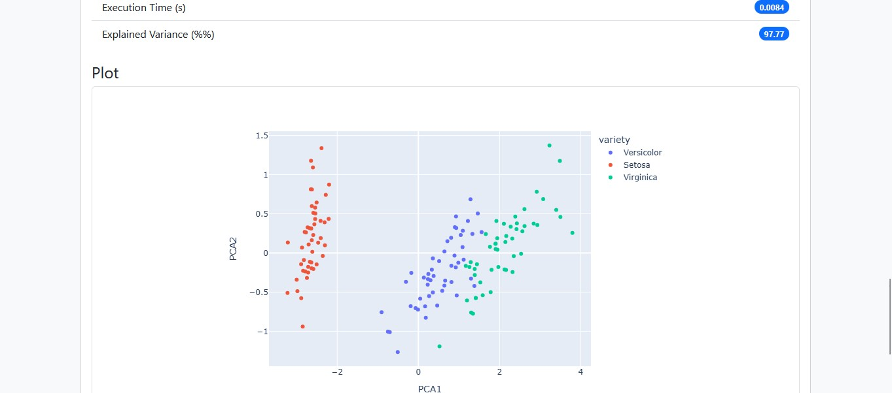

# ReduzLab 🧪

---

[Versão em Português](#portuguese-version)
[English Version](#english-version) 

---

<a name="portuguese-version"></a>
## ✨ Descrição 📝 

ReduzLab é uma aplicação web interativa construída com Flask para aplicar, visualizar e comparar diferentes algoritmos de redução de dimensionalidade da biblioteca Scikit-learn. A ferramenta permite que usuários façam upload de seus próprios datasets, ajustem parâmetros base e avançados dos algoritmos e visualizem os resultados em 2D ou 3D.





**Upload de Datasets:** Suporte para arquivos `.csv` e `.xlsx`.

**Algoritmos presentes na aplicação:**   
* PCA 
* KPCA
* t-SNE
* LDA
* NCA
* LLE
* Isomap

**Configuração Detalhada:** Controle sobre parâmetros base (amostragem, coluna alvo, escalonador) e parâmetros avançados específicos de cada algoritmo.

**Visualização Interativa:** Geração de gráficos 2D/3D com Plotly, com opção de exportação em `.png` ou `.html`.

**Validação de Dados:** Análise automática do dataset enviado, alertando sobre colunas não-numéricas ou com valores ausentes.

**Histórico de Arquivos:** Uma página para visualizar e baixar todos os datasets enviados e resultados gerados.

--- 

## 🛠️ Tecnologias Utilizadas 

**Backend:** Python, Flask
**Processamento de Dados:** Pandas, Scikit-learn
**Visualização:** Plotly
**Frontend:** HTML, Bootstrap 5
**Tradução:** Flask-Babel
**Containerização:** Docker, Docker Compose

---

## 🚀 Como Executar o Projeto 

Existem duas maneiras de executar a aplicação: localmente com um ambiente virtual Python ou usando Docker (método recomendado para facilidade e consistência).

### Opção 1: Ambiente Virtual (Método Tradicional)

**Pré-requisitos:**
* Python 3.10+
* `pip` e `venv`

**Passo a passo:**
1.  **Clone o repositório:**
    ```bash
    git clone https://github.com/joao-victor-costa-gomes/ReduzLab.git
    cd ReduzLab
    ```

2.  **Crie e ative um ambiente virtual:**
    ```bash
    # Criar
    python -m venv reduzlab_venv

    # Ativar (Windows)
    .\reduzlab_venv\Scripts\activate

    # Ativar (Linux/macOS)
    source reduzlab_venv/bin/activate
    ```

3.  **Instale as dependências:**
    ```bash
    pip install -r requirements.txt
    ```

4.  **Configure as variáveis de ambiente:**
    Copie o arquivo de exemplo e configure sua chave secreta.
    ```bash
    # Windows
    copy .env.example .env

    # Linux/macOS
    cp .env.example .env
    ```
    *Abra o arquivo `.env` e altere a `SECRET_KEY` para uma string aleatória.*

5.  **Execute a aplicação:**
    ```bash
    python run.py
    ```

6.  **Acesse** a aplicação no seu navegador em: `http://localhost:5000`

### Opção 2: Com Docker (Método Recomendado)

**Pré-requisitos:**
* [Docker](https://www.docker.com/products/docker-desktop/)
* Docker Compose

**Passo a passo:**
1.  **Clone o repositório:**
    ```bash
    git clone https://github.com/joao-victor-costa-gomes/ReduzLab.git
    ```

2.  **Configure as variáveis de ambiente:**
    Copie o arquivo de exemplo. O Docker Compose o usará automaticamente.
    ```bash
    # Windows
    copy .env.example .env

    # Linux/macOS
    cp .env.example .env
    ```
    *Abra o arquivo `.env` e altere a `SECRET_KEY`.*

3.  **Construa e inicie os contêineres:**
    Este comando único irá construir a imagem (se necessário) e iniciar a aplicação.
    ```bash
    docker-compose up --build
    ```

4.  **Acesse** a aplicação no seu navegador em: `http://localhost:5000`

5.  **Para parar a aplicação:** Pressione `Ctrl+C` no terminal. Para parar e remover os contêineres, use:
    ```bash
    docker-compose down
    ```

---

<a name="english-version"></a>

## ✨ Overview 📝 

ReduzLab is an interactive web application built with Flask to apply, visualize, and compare various dimensionality reduction algorithms from the Scikit-learn library. The tool allows users to upload their own datasets, adjust base and advanced algorithm parameters, and visualize the results in 2D or 3D.





**Dataset Upload:** Supports `.csv` and `.xlsx` files.

**Implemented Algorithms:**   
* PCA 
* KPCA
* t-SNE
* LDA
* NCA
* LLE
* Isomap

**Detailed Configuration:** Control over base parameters (sampling, target column, scaler) and algorithm-specific advanced parameters.

**Interactive Visualization:** Generates 2D/3D plots with Plotly, with export options for `.png` or `.html`.

**Data Validation:** Automatic analysis of the uploaded dataset, alerting about non-numeric columns or missing values.

**File History:** A dedicated page to view and download all uploaded datasets and generated results.

--- 

## 🛠️ Technologies Used

**Backend:** Python, Flask
**Data Processing:** Pandas, Scikit-learn
**Visualization:** Plotly
**Frontend:** HTML, Bootstrap 5
**Translation:** Flask-Babel
**Containerization:** Docker, Docker Compose

---

## 🚀 How to Run the Project 

There are two ways to run the application: locally with a Python virtual environment or using Docker (recommended method for ease and consistency).

### Option 1: Virtual Environment (Traditional Method)

**Prerequisites:**
* Python 3.10+
* `pip` and `venv`

**Step-by-step:**
1.  **Clone the repository:**
    ```bash
    git clone https://github.com/joao-victor-costa-gomes/ReduzLab.git
    cd ReduzLab
    ```

2.  **Create and activate a virtual environment:**
    ```bash
    # Create
    python -m venv reduzlab_venv

    # Activate (Windows)
    .\reduzlab_venv\Scripts\activate

    # Activate (Linux/macOS)
    source reduzlab_venv/bin/activate
    ```

3.  **Install dependencies:**
    ```bash
    pip install -r requirements.txt
    ```

4.  **Configure environment variables:**
    Copy the example file and configure your secret key.
    ```bash
    # Windows
    copy .env.example .env

    # Linux/macOS
    cp .env.example .env
    ```
    *Open the `.env` file and change the `SECRET_KEY` to a random string.*

5.  **Run the application:**
    ```bash
    python run.py
    ```

6.  **Access** the application in your browser at: `http://localhost:5000`

### Option 2: With Docker (Recommended Method)

**Prerequisites:**
* [Docker](https://www.docker.com/products/docker-desktop/)
* Docker Compose

**Step-by-step:**
1.  **Clone the repository:**
    ```bash
    git clone https://github.com/joao-victor-costa-gomes/ReduzLab.git
    cd ReduzLab
    ```

2.  **Configure environment variables:**
    Copy the example file. Docker Compose will use it automatically.
    ```bash
    # Windows
    copy .env.example .env

    # Linux/macOS
    cp .env.example .env
    ```
    *Open the `.env` file and change the `SECRET_KEY`.*

3.  **Build and start the containers:**
    This single command will build the image (if necessary) and start the application.
    ```bash
    docker-compose up --build
    ```

4.  **Access** the application in your browser at: `http://localhost:5000`

5.  **To stop the application:** Press `Ctrl+C` in the terminal. To stop and remove the containers, use:
    ```bash
    docker-compose down
    ```

---